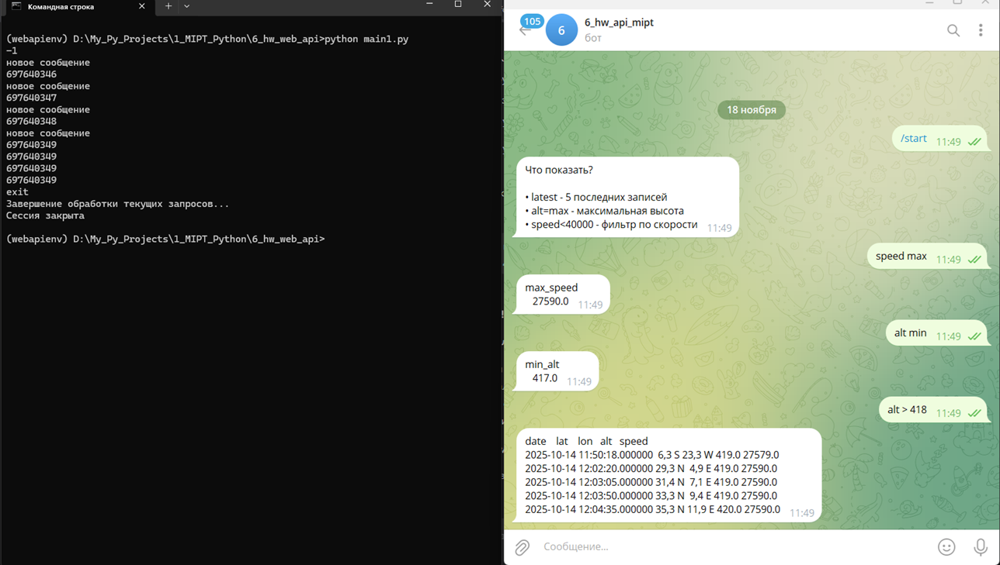

# 6_hw_mipt_web_api
## Телеграм-бот (бэкенд) для получения среза данных о положении на орбите Международной Космической Станции (МКС)
## Задача:
- создать телеграм-бота для получения данных из базы о текущих параметрах МКС (широта, долгота, высота, скорость);
- Эндпоинт должен позволять получать небольшой срез данных из базы с данными со скраперов.

## Описание:
- телеграм-бот @hw_api_mipt_bot:
    - предназначен для отображения информации, касающейся положения МКС на орбите
    - в качестве источника данных используется csv-файл от скраппера 
    - запуск бота из консоли: python iss_data_bot.py  
    - для преращения работы приложения набрать в консоли exit и нажать Enter    
    - файл с "сырыми" данными по умолчанию должен находиться в той же папке, откуда запускается приложение; при необходимости путь к файлу с данными указывается в config.py
- список используемых библиотек в файле requirements.txt

## Конфигурация:
    - через файл config.py

## Пример результата обработки

 

